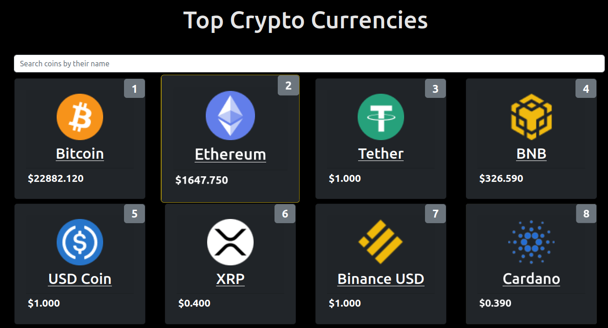

<a name="readme-top"></a>


<div align="center">
  <!-- You are encouraged to replace this logo with your own! Otherwise you can also remove it. -->
  
  <br/>

  <h3><b>React Crypto metrics app</b></h3>

</div>

<!-- TABLE OF CONTENTS -->

# 📗 Table of Contents

- [📗 Table of Contents](#-table-of-contents)
- [📖 React Crypto metrics app ](#-react-crypto-metrics-app-)
  - [🛠 Built With ](#-built-with-)
    - [Tech Stack ](#tech-stack-)
    - [Key Features ](#key-features-)
  - [🚀 Live Demo ](#-live-demo-)
  - [💻 Getting Started ](#-getting-started-)
    - [Prerequisites](#prerequisites)
    - [Setup](#setup)
    - [Install](#install)
    - [Usage](#usage)
    - [Run tests](#run-tests)
    - [Deployment](#deployment)
  - [👥 Authors ](#-authors-)
  - [🔭 Future Features ](#-future-features-)
  - [🤝 Contributing ](#-contributing-)
  - [⭐️ Show your support ](#️-show-your-support-)
  - [🙏 Acknowledgments ](#-acknowledgments-)
  - [📝 License ](#-license-)

<!-- PROJECT DESCRIPTION -->

# 📖 React Crypto metrics app <a name="about-project"></a>


It is a web application built with React and Redux that enables users to check a list of metrics (numeric values).It is based on an API for a [crypto currency](https://api.coinstats.app/public/v1/coins). The app shows a list of cryptocurrency that has been named-filtered. The user may also review the specifics of a chosen item.

## 🛠 Built With <a name="built-with"></a>

### Tech Stack <a name="tech-stack"></a>

<details>
  <summary>Client</summary>
  <ul>
    <li><a href="https://reactjs.org/">React.js</a></li>
  </ul>
</details>  
<!-- Features -->

### Key Features <a name="key-features"></a>

- **API**
- **SPA**
- **Filtering**

<p align="right">(<a href="#readme-top">back to top</a>)</p>

<!-- LIVE DEMO -->

## 🚀 Live Demo <a name="live-demo"></a>

- [Live Demo Link](https://metrics-webapp-qu1r.onrender.com/)
- [Video description](https://www.loom.com/share/62c247723ec94f988d80a89cc223d586)

<p align="right">(<a href="#readme-top">back to top</a>)</p>

<!-- GETTING STARTED -->

## 💻 Getting Started <a name="getting-started"></a>


To get a local copy up and running, follow these steps.

### Prerequisites

In order to run this project you need:
- Understand CSS/HTML
- Understand JavaScript and React js


### Setup

Clone this repository to your desired folder:

```sh
  git clone https://github.com/GutemaG/metrics-webapp.git
  cd metrics-webapp
```

### Install

Install this project with:

```sh
  npm install
```

### Usage

To run the project, execute the following command:

```sh
  npm run dev
```

### Run tests

To run tests, run the following command:

```sh
  npm run test
```

### Deployment

You can deploy this project using:
  - [GitHub page](https://github.com/belaymit/intro-mern-stack/settings/pages)
  - [Render](https://render.com/)
  - [netlify](https://www.netlify.com/)
<p align="right">(<a href="#readme-top">back to top</a>)</p>

<!-- AUTHORS -->

## 👥 Authors <a name="authors"></a>

👤 **Birhanu Gudisa**

- GitHub: [@GutemaG](https://github.com/GutemaG)
- Twitter: [@birhanugudisa3](https://twitter.com/birhanugudisa3)
- LinkedIn: [birhanugudisa](https://linkedin.com/in/birhanugudisa)

<p align="right">(<a href="#readme-top">back to top</a>)</p>


## 🔭 Future Features <a name="future-features"></a>

- [ ] **Add Pagination**
<p align="right">(<a href="#readme-top">back to top</a>)</p>

<!-- CONTRIBUTING -->

## 🤝 Contributing <a name="contributing"></a>

Contributions, issues, and feature requests are welcome!

Feel free to check the [issues page]([../../issues/](https://github.com/GutemaG/metrics-webapp/issues)).

<p align="right">(<a href="#readme-top">back to top</a>)</p>

<!-- SUPPORT -->

## ⭐️ Show your support <a name="support"></a>

If you like this project give it a **star**

<p align="right">(<a href="#readme-top">back to top</a>)</p>

<!-- ACKNOWLEDGEMENTS -->

## 🙏 Acknowledgments <a name="acknowledgements"></a>


I would like to thank Microverse community and Nelson Sakwa the author of the original design

<p align="right">(<a href="#readme-top">back to top</a>)</p>


<!-- LICENSE -->

## 📝 License <a name="license"></a>

This project is [MIT](./MIT.md) licensed.

<p align="right">(<a href="#readme-top">back to top</a>)</p>